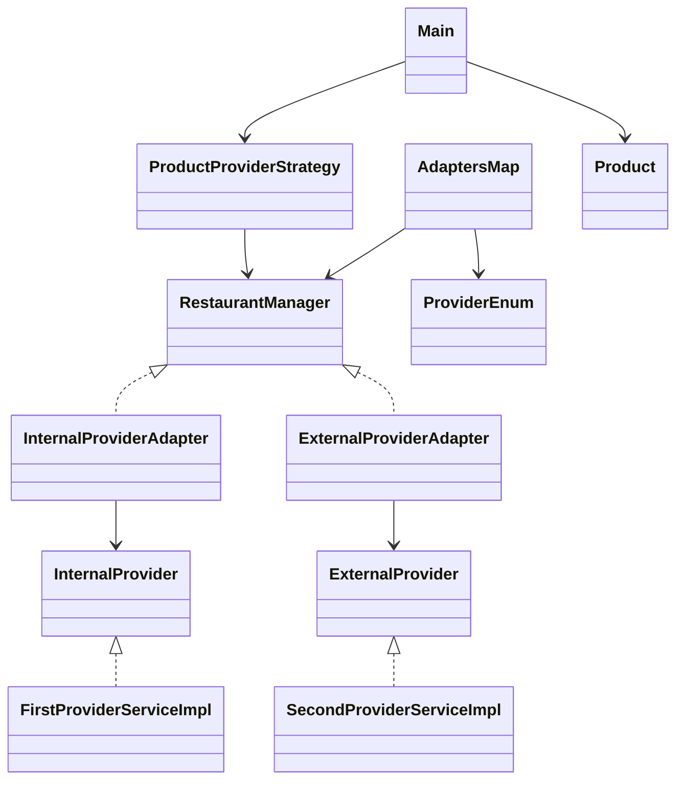
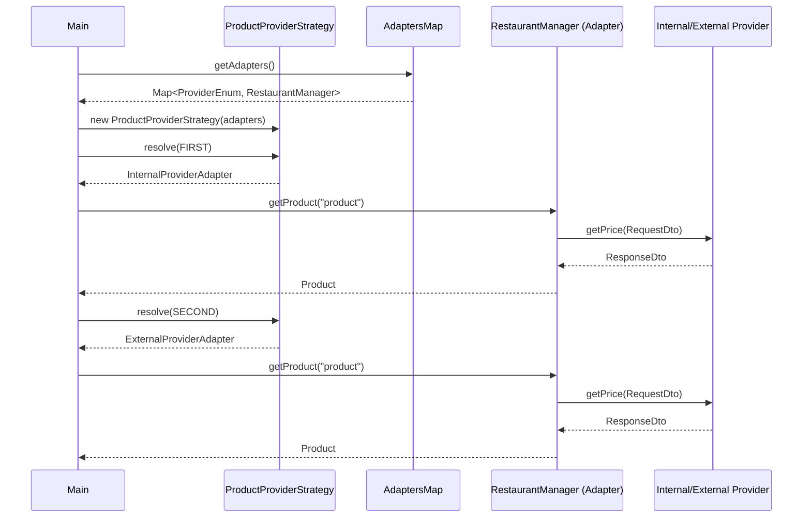

# 📐 Adapter Pattern – Java

A simple and didactic example of the **Adapter Structural Design Pattern**, implemented in **Java**.  
The goal is to demonstrate how to adapt a class with an incompatible interface so it can be used by an existing client.

---

## 🧠 What is the Adapter Pattern?

The **Adapter Pattern** allows classes with incompatible interfaces to work together.  
It acts as an intermediary that translates the interface of an existing class (*Adaptee*) into the interface expected by the client (*Target*), without modifying the original code.

---

## 🎯 Project Goals

- Demonstrate a clear implementation of the Adapter pattern  
- Keep the example simple and focused on the concept  
- Serve as educational or reference material  

---

## 🗂️ Project Structure

```text
src/
├─ main/java/
│  ├─ adapter/
│  │  ├─ InternalProviderAdapter.java
│  │  └─ ExternalProviderAdapter.java
│  ├─ domain/
│  │  ├─ Product.java
│  │  └─ Provider.java
│  ├─ dto/
│  │  ├─ provider/
│  │  │  ├─ req/
│  │  │  │  ├─ InternalProviderRequestDto.java
│  │  │  │  └─ ExternalProviderRequestDto.java
│  │  │  └─ resp/
│  │  │     ├─ InternalProviderResponseDto.java
│  │  │     └─ ExternalProviderResponseDto.java
│  │  ├─ ProviderRequestDto.java
│  │  └─ ProviderResponseDto.java
│  ├─ enums/
│  │  └─ ProviderEnum.java
│  ├─ manager/
│  │  └─ RestaurantManager.java
│  ├─ service/
│  │  ├─ InternalProvider.java
│  │  ├─ ExternalProvider.java
│  │  └─ ProductProviderStrategy.java
│  ├─ service/impl/
│  │  ├─ FirstProviderServiceImpl.java
│  │  └─ SecondProviderServiceImpl.java
│  └─ infra/
│     └─ AdaptersMap.java
└─ Main.java
```

---

## 🧩 Pattern Roles in This Example


- **Target (RestaurantManager)**
Defines the interface expected by the client to obtain a Product.

- **ConcreteTarget (InternalProviderAdapter, ExternalProviderAdapter)**
Classes that already implement the target interface and return Product.

- **Adaptee (InternalProvider, ExternalProvider)**  
Existing service interfaces with incompatible contracts that work with their own DTOs.

- FirstProviderServiceImpl → concrete implementation of InternalProvider.

- SecondProviderServiceImpl → concrete implementation of ExternalProvider.

- **Adapter (InternalProviderAdapter, ExternalProviderAdapter)**  
Adapts the provider interfaces to match RestaurantManager.

- **Client (Main, ProductProviderStrategy)**    
Works with objects of type RestaurantManager without knowing their concrete implementations. Uses ProviderEnum and AdaptersMap to resolve which adapter to use.

---

## 📈 UML Diagram



---

## 🔄 Sequence Diagram


